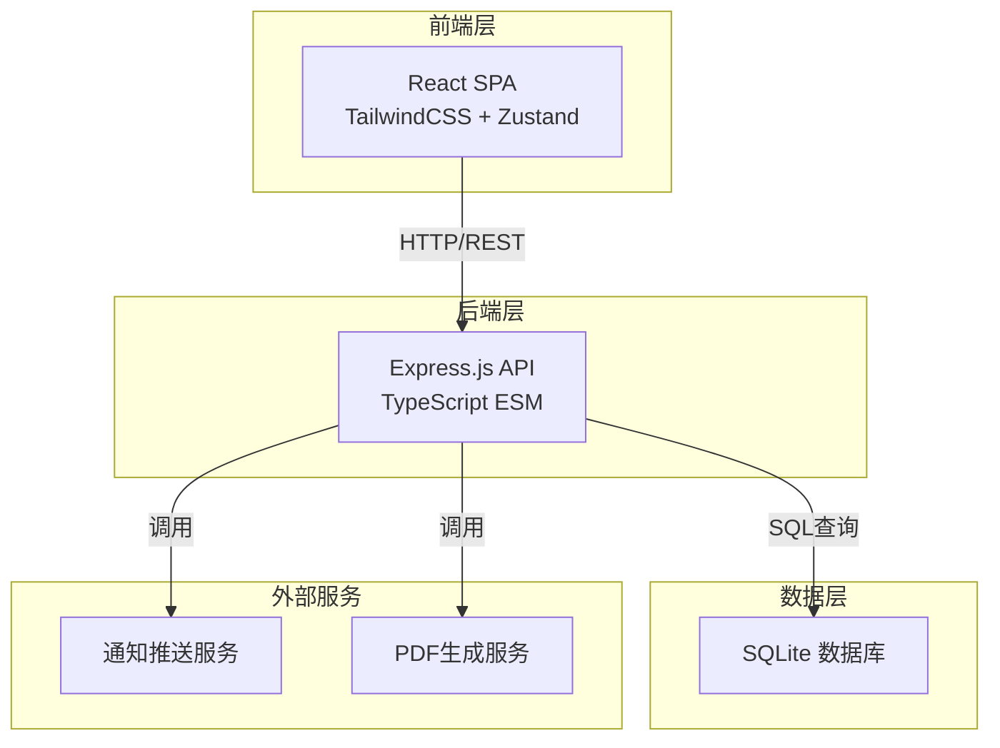
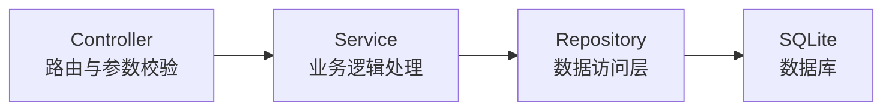
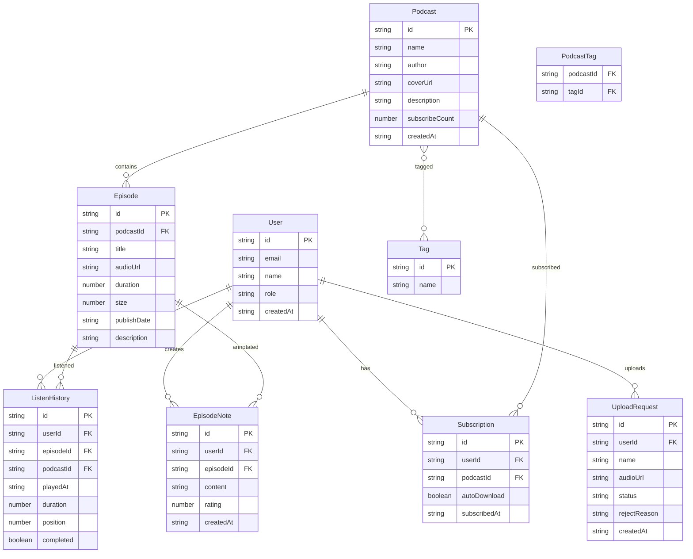

## 1. 架构设计



## 2. 技术说明

- **前端**：React@18 + TailwindCSS@3 + Vite + Zustand + React Router DOM
- **初始化工具**：vite-init (react-express-ts 模板)
- **后端**：Express@4 + TypeScript (ESM格式)
- **数据库**：SQLite (better-sqlite3)，Mock数据用于演示
- **PDF导出**：前端使用 html2canvas + jsPDF
- **音频播放**：HTML5 Audio API + Web Audio API (静音检测)

## 3. 路由定义

| 路由 | 用途 |
|------|------|
| / | 发现页 - 搜索/推荐/热门播客 |
| /podcast/:id | 播客详情页 - 节目信息和剧集列表 |
| /player/:podcastId/:episodeId | 播放器页 - 音频播放和控制 |
| /subscriptions | 我的订阅页 - 已订阅播客列表 |
| /report | 收听报告页 - 每周收听报告和PDF导出 |
| /upload | 上传播客页 - 节目上传表单 |
| /admin | 管理员审核页 - 节目审核和标签管理 |

## 4. API定义

### 4.1 播客相关

```typescript
interface Podcast {
  id: string
  name: string
  author: string
  coverUrl: string
  description: string
  tags: string[]
  subscribeCount: number
  createdAt: string
}

interface Episode {
  id: string
  podcastId: string
  title: string
  audioUrl: string
  duration: number
  size: number
  publishDate: string
  description: string
}

// GET /api/podcasts - 获取播客列表（支持搜索和标签筛选）
// GET /api/podcasts/:id - 获取播客详情
// GET /api/podcasts/:id/episodes - 获取播客剧集列表
// POST /api/podcasts - 上传播客（需校验）
```

### 4.2 订阅相关

```typescript
interface Subscription {
  id: string
  userId: string
  podcastId: string
  autoDownload: boolean
  subscribedAt: string
}

// GET /api/subscriptions - 获取用户订阅列表
// POST /api/subscriptions - 添加订阅
// DELETE /api/subscriptions/:podcastId - 取消订阅
// PATCH /api/subscriptions/:podcastId - 更新订阅设置（自动下载开关）
```

### 4.3 收听相关

```typescript
interface ListenHistory {
  id: string
  userId: string
  episodeId: string
  podcastId: string
  playedAt: string
  duration: number
  position: number
  completed: boolean
}

interface EpisodeNote {
  id: string
  userId: string
  episodeId: string
  content: string
  rating: number
  createdAt: string
}

// POST /api/listen - 记录收听
// GET /api/listen/history - 获取收听历史
// POST /api/episodes/:id/notes - 添加笔记和评分
// GET /api/episodes/:id/notes - 获取笔记
```

### 4.4 推荐相关

```typescript
interface Recommendation {
  podcastId: string
  reason: string
  matchTags: string[]
}

// GET /api/recommendations - 获取每周推荐
```

### 4.5 收听报告相关

```typescript
interface WeeklyReport {
  weekStart: string
  weekEnd: string
  totalDuration: number
  favoritePodcasts: Array<{ podcastId: string; name: string; duration: number }>
  consecutiveDays: number
  longestStreak: number
  dailyBreakdown: Array<{ date: string; duration: number }>
}

// GET /api/report/weekly - 获取本周收听报告
// GET /api/report/weekly/pdf - 导出PDF
```

### 4.6 管理员相关

```typescript
interface UploadRequest {
  id: string
  userId: string
  name: string
  audioUrl: string
  tags: string[]
  status: "pending" | "approved" | "rejected"
  rejectReason?: string
  createdAt: string
}

// GET /api/admin/pending - 获取待审核列表
// POST /api/admin/approve/:id - 审核通过
// POST /api/admin/reject/:id - 审核拒绝
// GET /api/admin/tags - 获取所有标签
// POST /api/admin/tags - 创建标签
// PUT /api/admin/tags/:id - 更新标签
// DELETE /api/admin/tags/:id - 删除标签
```

### 4.7 校验规则

```typescript
interface UploadValidation {
  name: string       // 非空校验
  audioFormat: "mp3"  // 仅限MP3格式
  audioSize: number   // 不超过50MB (52428800 bytes)
}

// 校验失败时返回明确错误提示：
// - 节目名称不能为空
// - 音频格式仅限MP3
// - 音频文件大小不能超过50MB
```

## 5. 服务器架构图



## 6. 数据模型

### 6.1 数据模型定义



### 6.2 数据定义语言

```sql
CREATE TABLE users (
  id TEXT PRIMARY KEY,
  email TEXT NOT NULL UNIQUE,
  name TEXT NOT NULL,
  role TEXT NOT NULL DEFAULT 'user',
  created_at TEXT NOT NULL DEFAULT (datetime('now'))
);

CREATE TABLE podcasts (
  id TEXT PRIMARY KEY,
  name TEXT NOT NULL,
  author TEXT NOT NULL,
  cover_url TEXT,
  description TEXT,
  subscribe_count INTEGER DEFAULT 0,
  created_at TEXT NOT NULL DEFAULT (datetime('now'))
);

CREATE TABLE episodes (
  id TEXT PRIMARY KEY,
  podcast_id TEXT NOT NULL REFERENCES podcasts(id),
  title TEXT NOT NULL,
  audio_url TEXT NOT NULL,
  duration INTEGER DEFAULT 0,
  size INTEGER DEFAULT 0,
  publish_date TEXT NOT NULL,
  description TEXT
);

CREATE TABLE tags (
  id TEXT PRIMARY KEY,
  name TEXT NOT NULL UNIQUE
);

CREATE TABLE podcast_tags (
  podcast_id TEXT NOT NULL REFERENCES podcasts(id),
  tag_id TEXT NOT NULL REFERENCES tags(id),
  PRIMARY KEY (podcast_id, tag_id)
);

CREATE TABLE subscriptions (
  id TEXT PRIMARY KEY,
  user_id TEXT NOT NULL REFERENCES users(id),
  podcast_id TEXT NOT NULL REFERENCES podcasts(id),
  auto_download INTEGER DEFAULT 1,
  subscribed_at TEXT NOT NULL DEFAULT (datetime('now')),
  UNIQUE(user_id, podcast_id)
);

CREATE TABLE listen_history (
  id TEXT PRIMARY KEY,
  user_id TEXT NOT NULL REFERENCES users(id),
  episode_id TEXT NOT NULL REFERENCES episodes(id),
  podcast_id TEXT NOT NULL REFERENCES podcasts(id),
  played_at TEXT NOT NULL DEFAULT (datetime('now')),
  duration INTEGER DEFAULT 0,
  position INTEGER DEFAULT 0,
  completed INTEGER DEFAULT 0
);

CREATE TABLE episode_notes (
  id TEXT PRIMARY KEY,
  user_id TEXT NOT NULL REFERENCES users(id),
  episode_id TEXT NOT NULL REFERENCES episodes(id),
  content TEXT,
  rating INTEGER CHECK(rating >= 1 AND rating <= 5),
  created_at TEXT NOT NULL DEFAULT (datetime('now'))
);

CREATE TABLE upload_requests (
  id TEXT PRIMARY KEY,
  user_id TEXT NOT NULL REFERENCES users(id),
  name TEXT NOT NULL,
  audio_url TEXT NOT NULL,
  status TEXT NOT NULL DEFAULT 'pending',
  reject_reason TEXT,
  created_at TEXT NOT NULL DEFAULT (datetime('now'))
);

CREATE INDEX idx_episodes_podcast ON episodes(podcast_id);
CREATE INDEX idx_subscriptions_user ON subscriptions(user_id);
CREATE INDEX idx_listen_history_user ON listen_history(user_id);
CREATE INDEX idx_listen_history_episode ON listen_history(episode_id);
CREATE INDEX idx_episode_notes_episode ON episode_notes(episode_id);
CREATE INDEX idx_upload_requests_status ON upload_requests(status);
```
